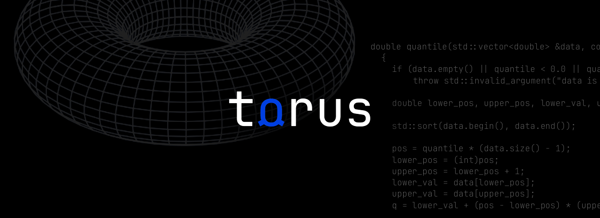

# torus-lib
Torus - math statistics library



## Dependencies
* [gnuplot](http://www.gnuplot.info/) (software for generation plots of functions, data, and data fits)

Installation of gnuplot in Debian, Ubuntu and etc.
```c
sudo apt install gnuplot
```

## Installation
First clone this repository:
```console
git clone https://github.com/alkuzin/torus-lib.git
```

Then move to library directory and build library:
```cpp
cd torus-lib/ && make all
```

Then include the __`torus.h`__ header file in your project.
```c
#include "<path to your project>/include/torus.h"
/* project code here */
```
Finaly compile your project, including __`libtorus.a`__ file.

```console
g++ main.cpp libtorus.a -o main
```

To return everything to original state:
```console
make fclean
```